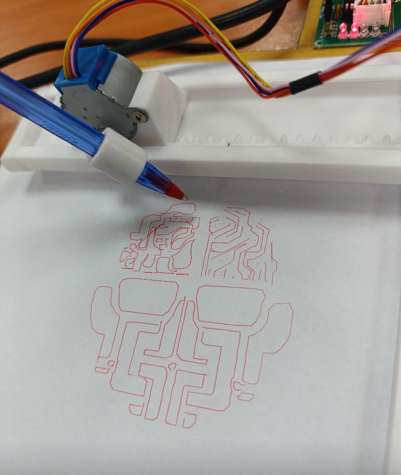

# Pen Plotter Project 🖋️

  
*A precise and elegant system for automated drawing using Arduino control.*

---

## ✨ Features
- **Modern Web UI**: A sleek, user-friendly Electron application for easy control and visualization.
- **High-Precision Movement**: DC motors with encoders ensure accurate X/Y/Z-axis positioning.
- **Interactive GUI**: Built with Python and Tkinter for shape design and command execution.
- **3D-Printed Frame**: Customizable modular structure for easy assembly.
- **Automated Workflow**: Converts digital designs into physical drawings via Arduino.

---

## ⚡ Circuit Diagram
<object data="rapport/penplotter.pdf" type="application/pdf" width="100%" height="600px">
    <p>PDF cannot be displayed. <a href="rapport/penplotter.pdf">Download it</a> instead.</p>
</object>

### Components List
| Component               | Quantity | Description                  |
|-------------------------|----------|------------------------------|
| **416 DC Motor + Encoder**  | 3        | Controls X/Y/Z-axis movement |
| **Arduino Uno R3**      | 1        | Main microcontroller         |
| **9V Battery**          | 1        | Power supply                 |

⚠️ **Note**: The report mentions *Arduino Mega* and *stepper motors*, but the BOM and circuit diagram specify *Arduino Uno* and *DC motors*. Ensure consistency in your hardware setup.

---

## 🚀 Installation & Usage

### 🔧 Hardware Setup
1. Assemble the <a href="https://github.com/NacreousDawn596/PenPlotter/tree/master/components">3D-printed frame</a>.
2. Mount the motors and attach the pen mechanism.
3. Wire components as per the [circuit diagram](#⚡-circuit-diagram).

### 💻 Software Setup
```bash
# Clone the repository
git clone https://github.com/NacreousDawn596/Penplotter.git
```

#### 🖥️ For NixOS Users:
```bash
nix-shell
```

#### 🏗️ For Non-NixOS Users:
```bash
python3 -m venv venv
source venv/bin/activate  # On Windows, use 'venv\Scripts\activate'
pip install -r requirements.txt
arduino-cli core install arduino:avr
arduino-cli lib install Stepper
```
*install the `imagemagick` package as well if you wanna use the manual method, it's available in most package managers... or compile it from <a href="https://github.com/ImageMagick/ImageMagick">here</a>.*

### 🖥️ Electron Web UI (Recommended)

The easiest way to use the Pen Plotter is via the bundled Electron application.

#### Linux (AppImage)
1.  Download the latest `PenPlotter-x.x.x.AppImage` from the releases (or build it locally).
2.  Make it executable:
    ```bash
    chmod +x PenPlotter-1.0.0.AppImage
    ```
3.  Run it:
    ```bash
    ./PenPlotter-1.0.0.AppImage
    ```

#### Building from Source
If you want to build the application yourself:

1.  **Install Dependencies**:
    Ensure you have `npm`, `python3`, and `arduino-cli` installed.
    ```bash
    # Install Python dependencies
    pip install -r webui/backend/requirements.txt
    ```

2.  **Build the App**:
    ```bash
    cd webui/electron
    npm install
    npm run dist
    ```
    The output will be in `webui/electron/dist`.

### ✏️ Legacy / Manual Usage
#### 📌 Manual Drawing via GUI
```bash
python3 manual.py /path/to/image
```
**Controls:**
- **Middle Click**: Show/hide the image.
- **Right Click**: Draw connected polygons.
- **Left Click**: Draw a separate point and start a new polygon.
- **Close Window**: Saves the drawing.

#### 🖼️ Automatic Image-to-Sketch Conversion
```bash
python3 main.py -h  # Show help command, adjust the parameters as needed. almost every image needs its own parameters.
```
Example:
```bash
python3 main.py criam.jpg criam  # Convert 'criam.jpg' to a sketch and save the code to ./criam/criam.ino
```
Alternatively, use an online AI tool to convert complex images to sketches before processing with `main.py`.

#### Execute:
Simply navigate to the folder where you saved your file.ino
then:
```bash
arduino-cli board list
```
to show the available boards
and finally upload using:
```bash
alias ards="sudo arduino-cli compile --fqbn <board, like arduino:avr:mega> ./ 
sudo arduino-cli upload -p <Port, like /dev/ttyACM0> --fqbn <board, like arduino:avr:mega> ./"
```
Alternatively you can use the ArduinoIDE

---

## 📐 Results
### Geometric Shapes
Examples of drawings: **faces, cars, landscapes, etc...**.

---

## 🔮 Future Improvements
- ✅ Add **SVG file support** for more complex designs.
- ✅ Implement **wireless control** (Bluetooth/Wi-Fi).
- ✅ Enhance **precision** for intricate patterns.
- ✅ Integrate with **Raspberry Pi or ESP32** for advanced functionality.

---

**Crafted with ❤️ by the PenPlotter Team**

💡 **CRIAM** · [LinkedIn Page](https://ma.linkedin.com/in/club-robotique-et-innovation-arts-et-m%C3%A9tiers-74018b209)

